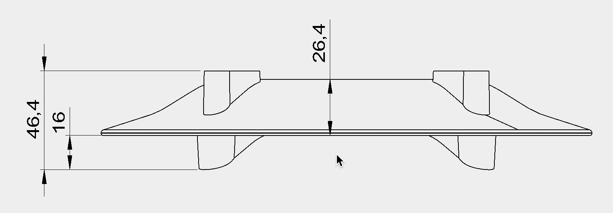
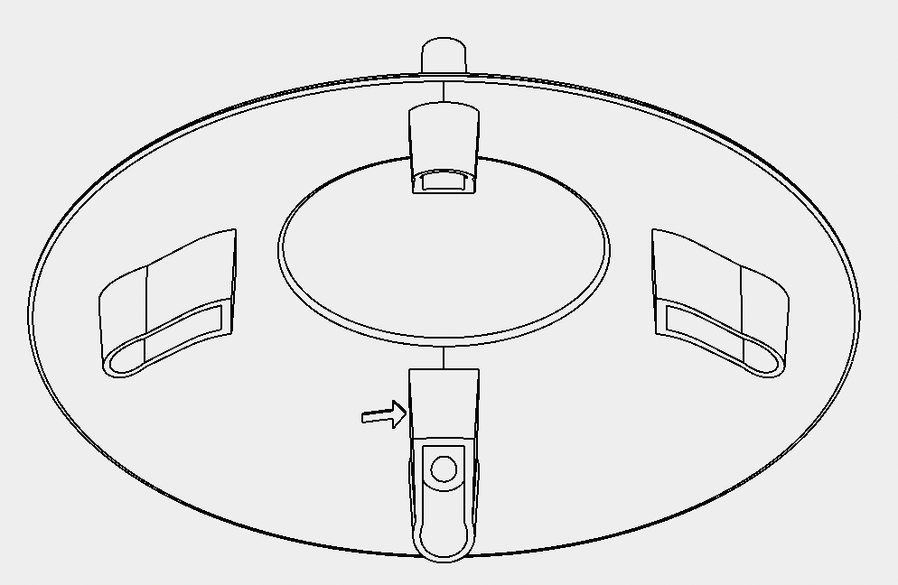
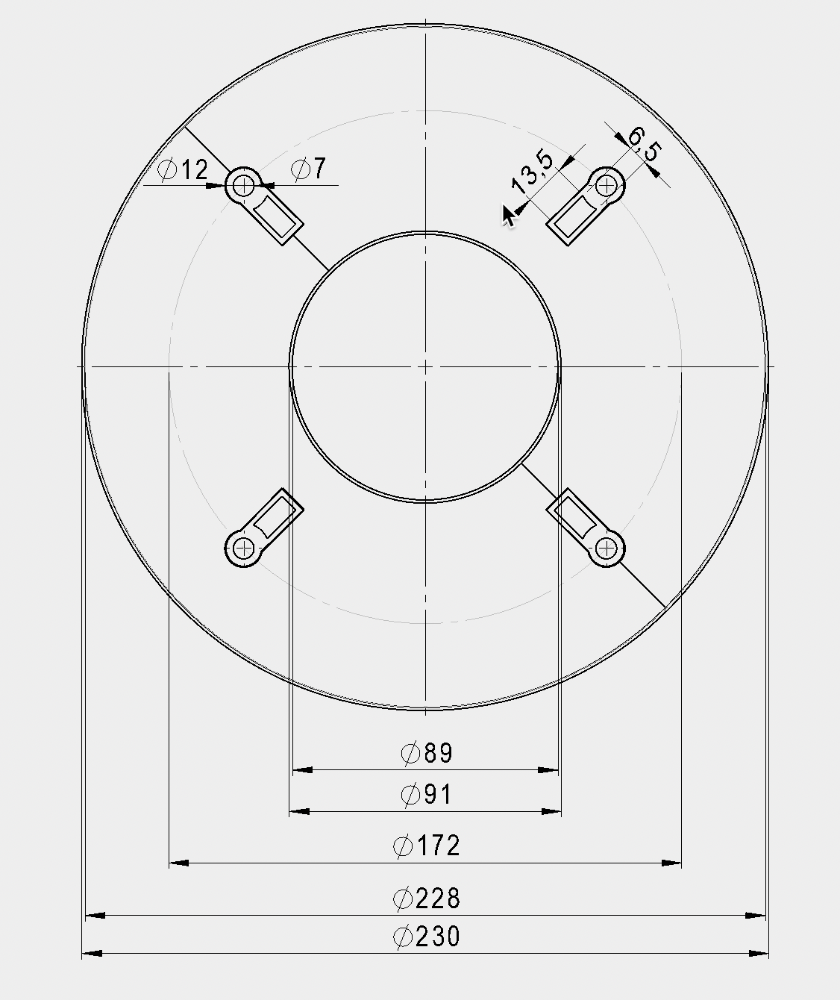
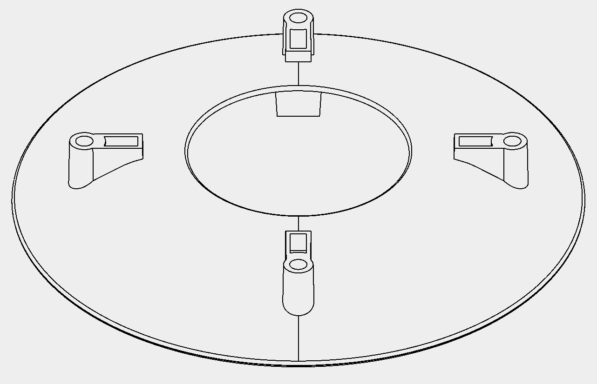
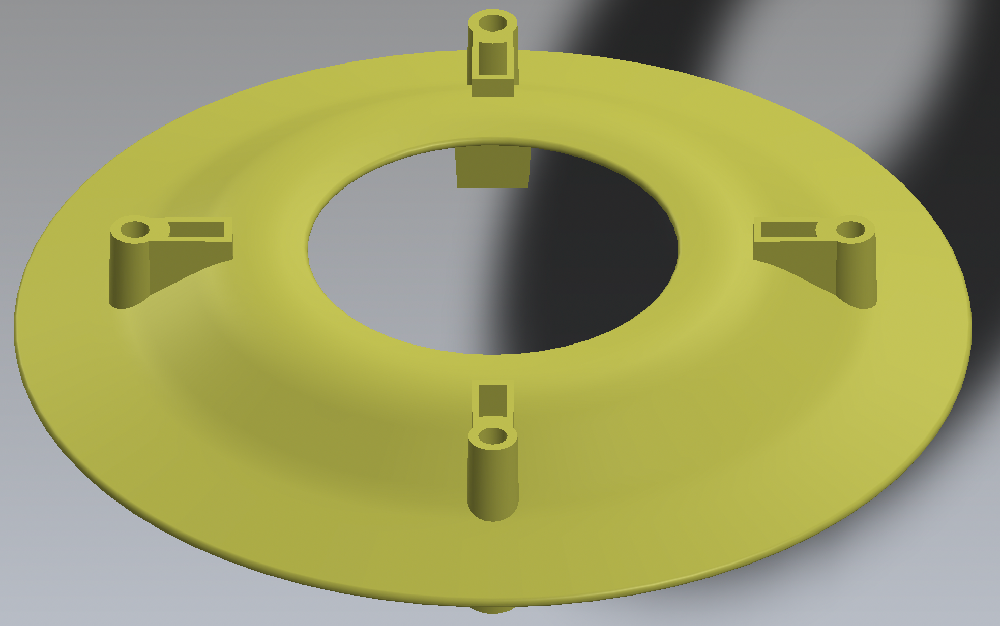
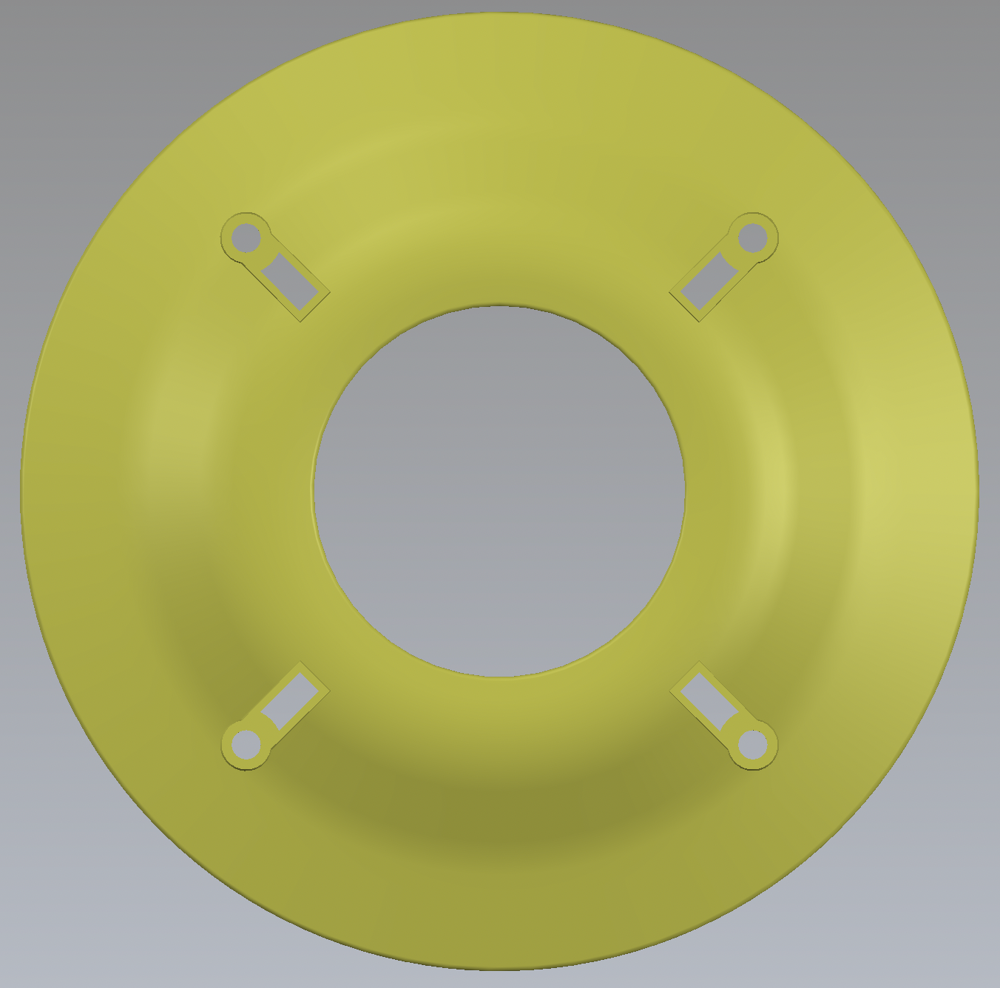
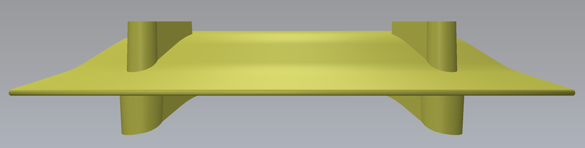
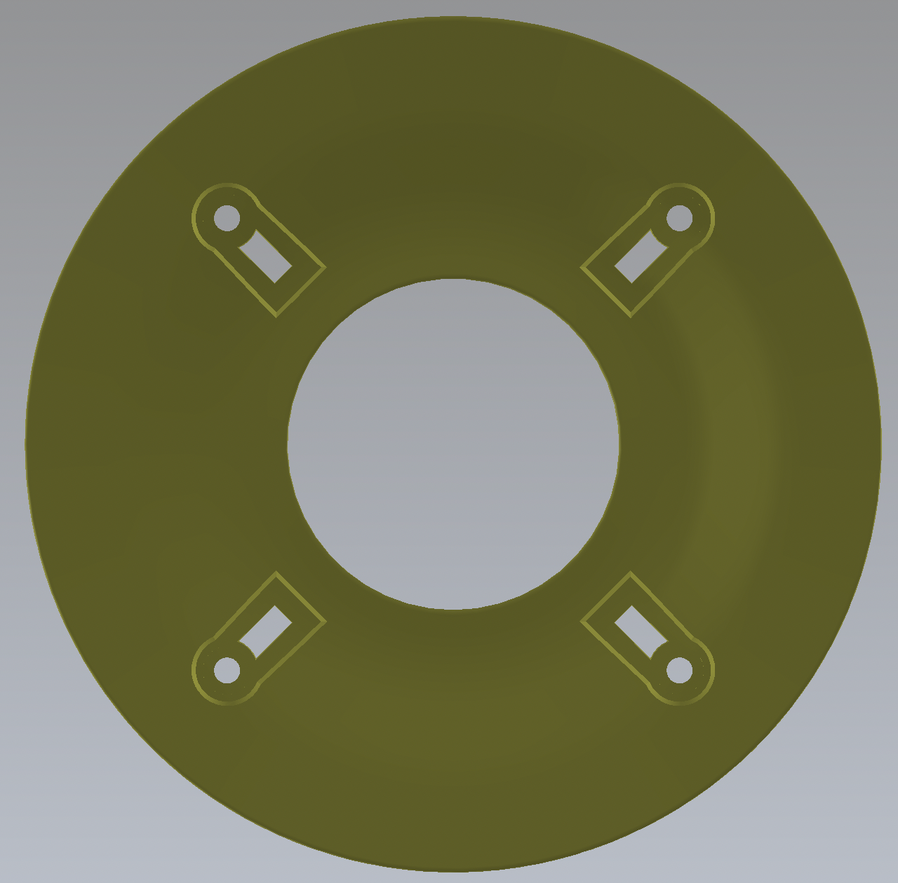

# C112BA - Radyasyon Kalkanı Yaprakları   &nbsp; &nbsp; 

| Parça Kodu | Parça Açıklaması | Parça Boyutları | Parça Malzemesi | Kullanım Adedi |
| ---------- | ---------------- | --------------- | --------------- | -------------- |
| C112BA     | Radyasyon Kalkanı Yaprakları        | Ø230 x 46.4 | ABS             | 5|

## Açıklama
C112BA parçası P101DA ürünün orta kısmında bulunan ve ürün üzerine 5 adet takılan parçadır.Bu parçanın ölçüleri Ø230-46.4 mm olup Ø172 olan yerinden diğer parçalara bağlanması için iç içe geçmeli bir yapısı vardır.

6.5x13.5 olan alanın birinden toprak sıcaklık sensörünün diğerinden ise Yağmur ölçüm ünitesinin kablosu geçmektedir.

## Teknik Bilgi
Malzeme:ABS Erime Sıcaklığı:210 ~ 280℃ Ağırlık:135 gram Hacim:100 cm3 

## Revizyon

    --
 

## Maliyet Bilgisi
Bu alana parçanın seri üretim maliyet tabloları yer alacaktır.

