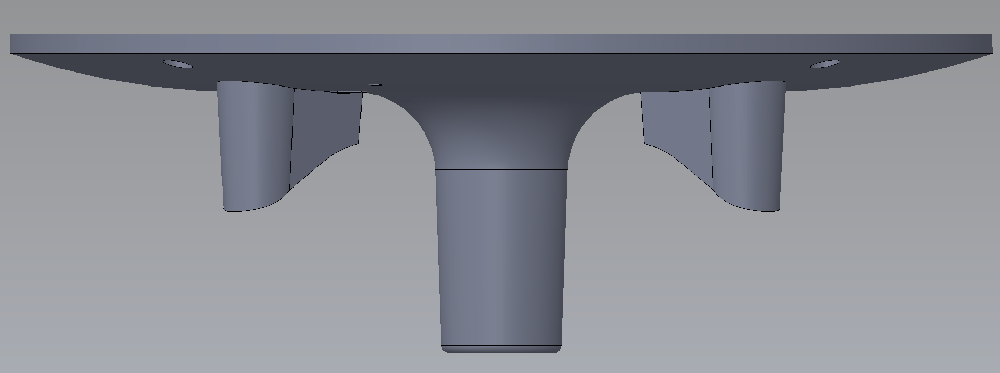
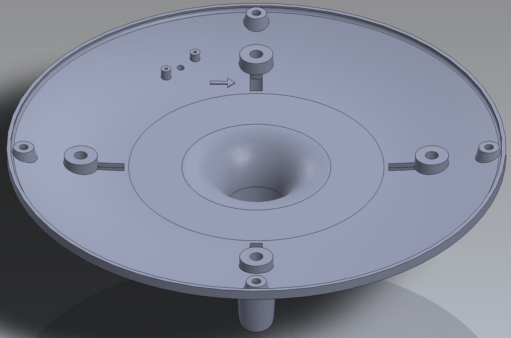
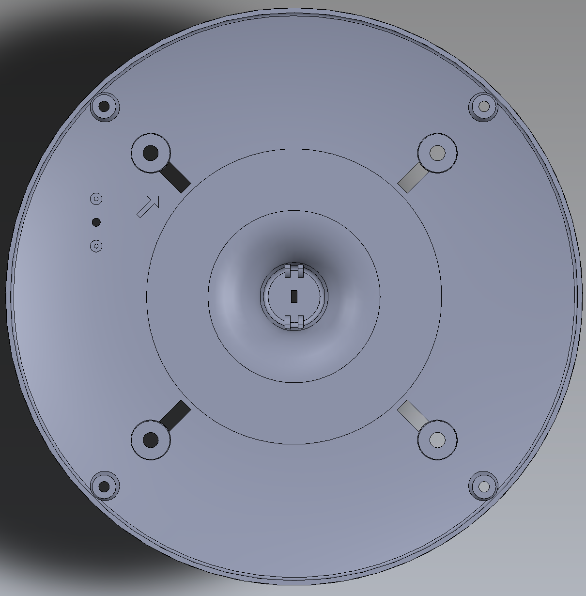
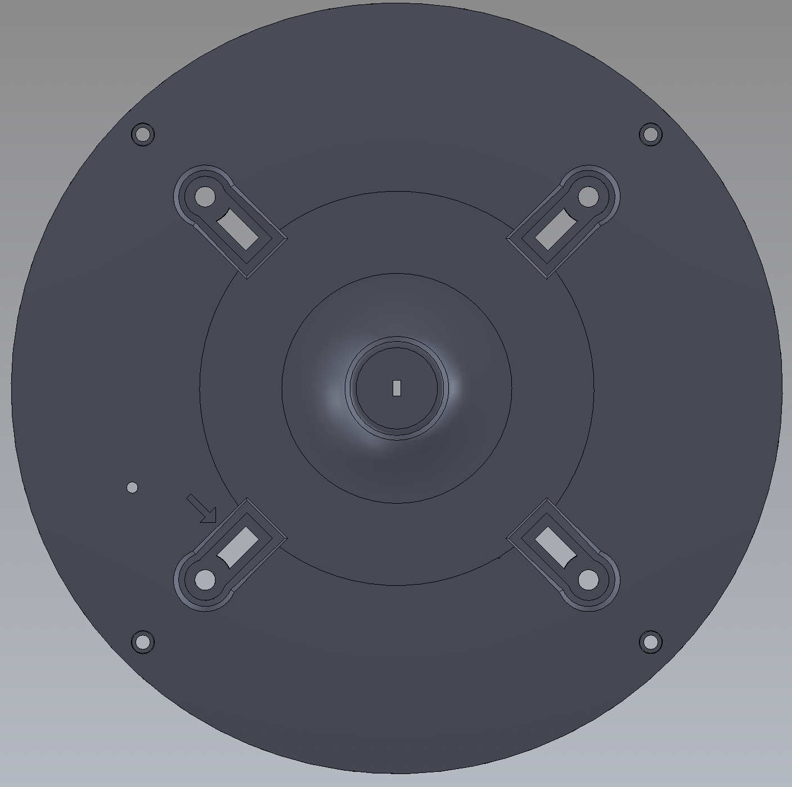

# C113CA - Üst Kapak Alt Parçası   &nbsp; &nbsp; 

| Parça Kodu | Parça Açıklaması | Parça Boyutları | Parça Malzemesi | Kullanım Adedi |
| ---------- | ---------------- | --------------- | --------------- | -------------- |
| C113CA     | Üst Kapak Alt Parçası        | Ø244.4 - 140 mm | ABS             | 1|

## Açıklama
C113CA parçası C111CA ve C112BA parçaları arasında bulunan parçadır.Bu kutunun ölçüleri Ø244 x 139.5 mm olup Ø3mm ölçüsünde olan 4 bağlantı deliğinden C111BA parçasına bağlanmaktadır.

Yan görünümünde bulunan 35,5x19,3mm olan ölçünün merkez deliği Ø1.5 olan delikten tasarlamış olduğumuz Sıcaklık-Nem sensörü bağlantısı yapılır.

Manuel veri gönderme butonu için geliştirdiğimiz PCB kartının üzerinde Ø210 ölçüsünde bulunan ve  Ø3,5 butonun geçeceği delik Ø1.7 olan 2 adet kart bağlantı deliği ile birlikte montajlanacaktır.

15x0.5mm ölçüde olan yarıktan sistemin aktif hale gelmesi için gerekli olan pil bağlantısının altında bulunan bantların dış tarafa çıkarılması için kullanılır.

13,3x6mm olan kanaldan C114BA parçasına bağlı olan mike soketin kablo bağlantısının soketinin geçebilmesi için tasarlanmıştır.

## Teknik Bilgi
Malzeme:ABS Erime Sıcaklığı:210 ~ 280℃ Ağırlık:300 gram Hacim:141 cm3 

## Revizyon \[BA-->CA][08.2022]

    -Pil koruma bandı çizgileri kapatıldı.
    -TH Sensör yeri revize edildi.
    -Üst ünite ile bağlantı şekli değiştirildi.
    -Th sensör kartı için çekmece yapıldı.
 

## C113CA  R1 (04.10.2022)
    - Sensör için aşağı inen çıkıntının boyu kısaltıldı.
  
## C113CA  R2 (14.10.2022)
    - Sensör için aşağı inen çıkıntının boyu 26mm uzatıldı.
    - Kart çekmecesi aralığı PCB kalınlığına uygun şekilde 1.6mm yapıldı.
  

## Maliyet Bilgisi
Bu alana parçanın seri üretim maliyet tabloları yer alacaktır.

    Yapılacak değişiklikler,
    - Yapılan değişikliklere göre mevcut kalıp revizyonu yaptırılacak.

