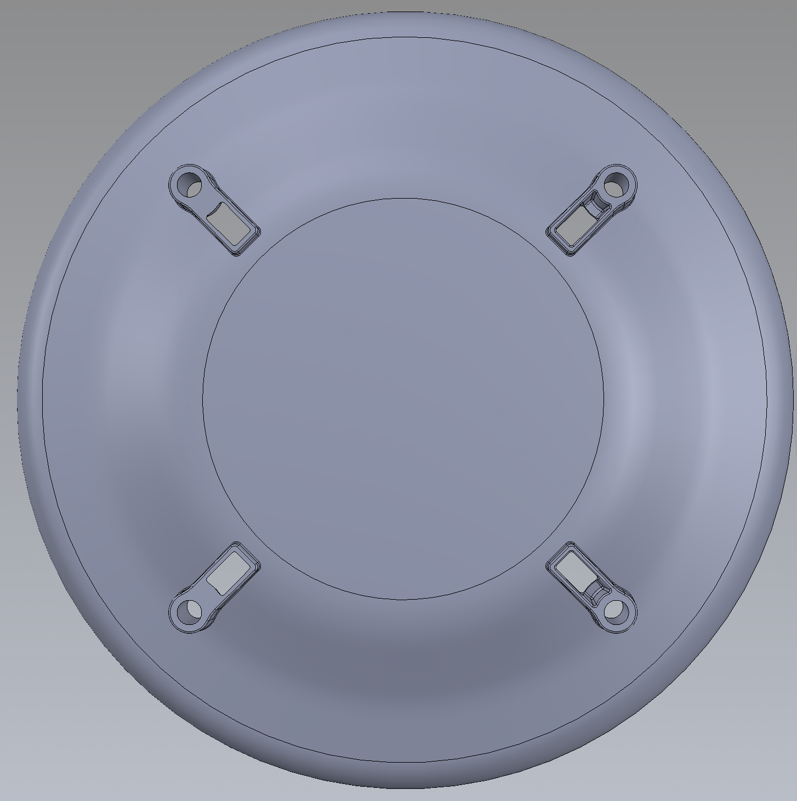

# C114CA - Alt Zemin   &nbsp; &nbsp; 

 Parça Kodu | Parça Açıklaması | Parça Boyutları | Parça Malzemesi | Kullanım Adedi |
| ---------- | ---------------- | --------------- | --------------- | -------------- |
| C114CA     | Alt Zemin       | Ø230 x 54.2 mm | ABS             | 1|

## Açıklama
C114CA parçası P101DA ürünün en altında bulunan kapaktır.Bu kapağın ölçüleri Ø230-54,2mm olup Ø171,8mm olan kısımlarından üst parçalarına bağlantı sağlanmaktadır.6,7-16,8mm kanalından alt kısımdan gelen bağlantı soketinin geçeceği kanaldır.

## Teknik Bilgi
Malzeme:ABS Erime Sıcaklığı:210 ~ 280℃ Ağırlık:250 gram Hacim:238 cm3 

## Revizyon \[BA-->CA][08.2022]

    -Kablo geçişler için açık olmayan iki kanal yeri de açıldı.
 

## Maliyet Bilgisi
Bu alana parçanın seri üretim maliyet tabloları yer alacaktır.

