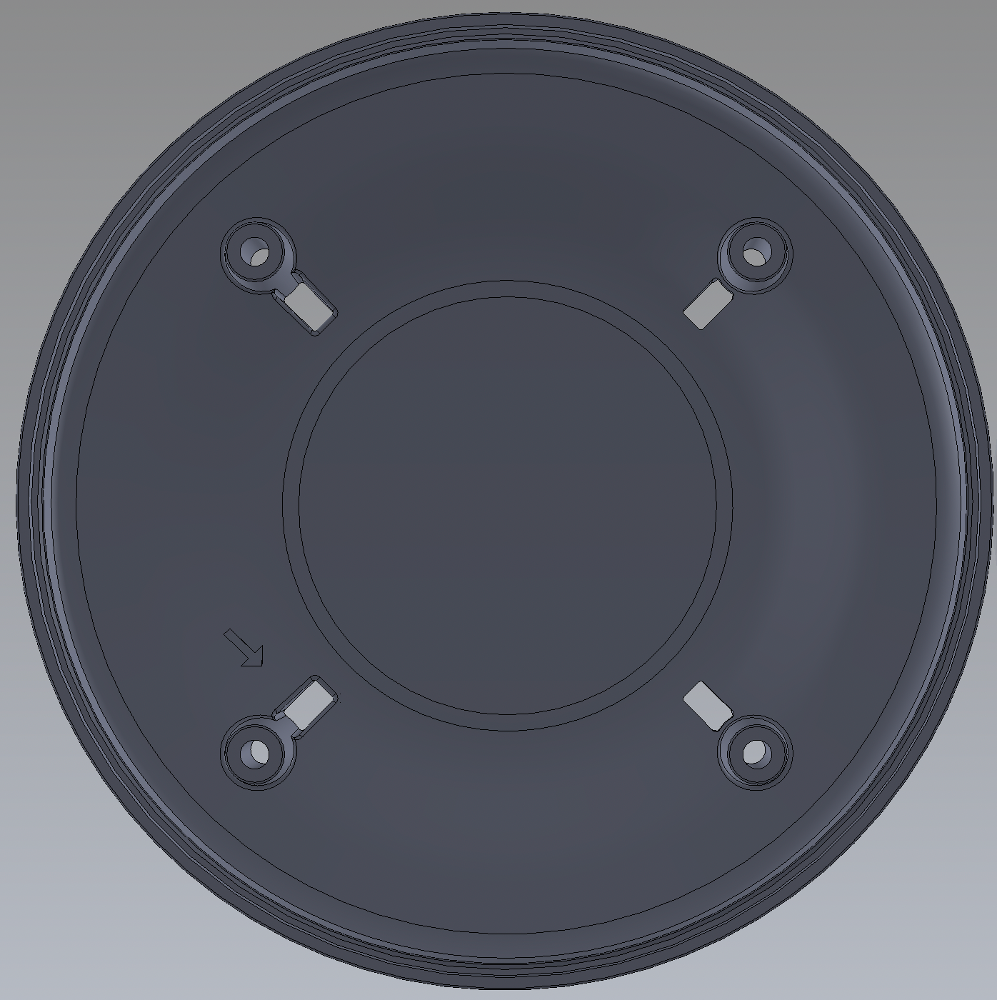
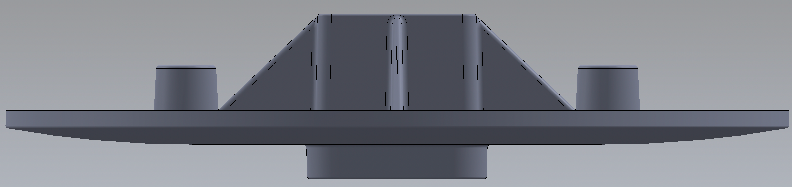
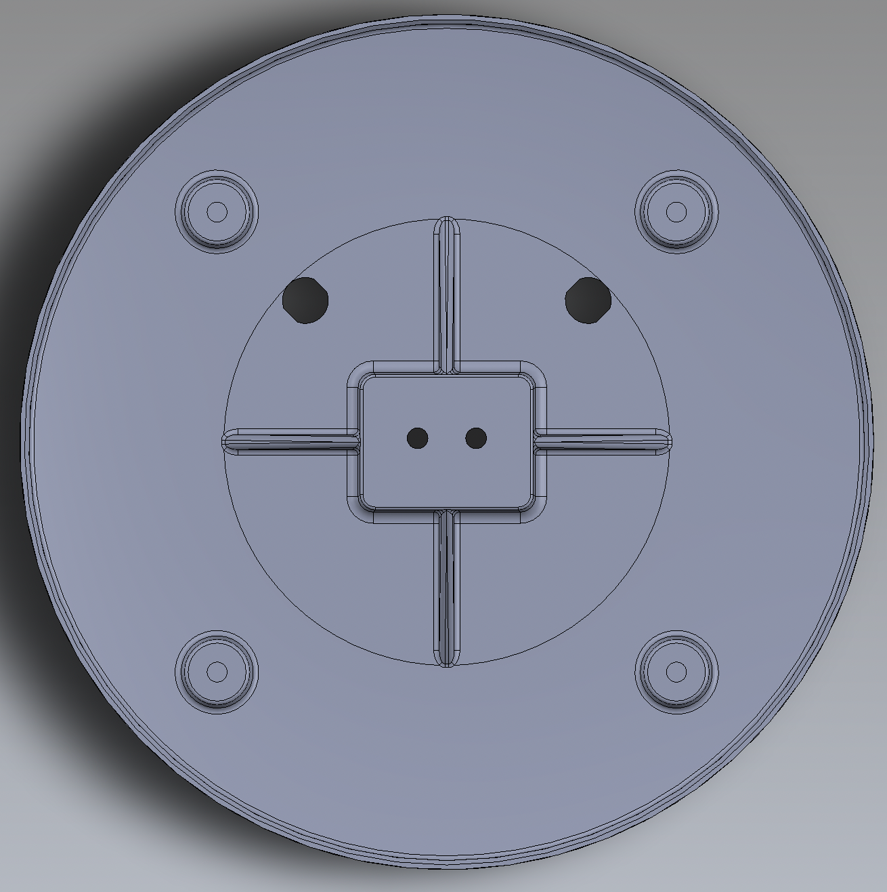

# C115BA - Alt Kapak   &nbsp; &nbsp; 
| Parça Kodu | Parça Açıklaması | Parça Boyutları | Parça Malzemesi | Kullanım Adedi |
| ---------- | ---------------- | --------------- | --------------- | -------------- |
| C115BA     | Alt kapak        | Ø235 x 21 mm    | ABS             | 1              |
## Açıklama
C115BA parçası P101DA ürününün en altında bulunan kapaktır.Bu kapağın ölçüleri Ø235-21mm olup kapağın merkezinden bağlantı ayağı için 40-30mm'lik dikdörtgen bir delik vardır.

Merkezine doğru mike soketin bağlanması için 12,2-11,1mm'lik bir delik mevcuttur.

Ø171,8mm merkez ölçüsü ve Ø6,5mm'lik 4 adet saplama bağlantı delikleri mevcuttur.

## Teknik Bilgi
Malzeme:ABS Erime Sıcaklığı:210 ~ 280℃ Ağırlık:140 gram Hacim:140,6 cm3 

## Revizyon \[AA-->BA][08.2022]

    - İzi olan soket yeri açıldı.
    - Diğer iki soket yerine ihtiyaç olduğunda kırılabilecek şekilde iz bırakıldı.
 

## Maliyet Bilgisi
Bu alana parçanın seri üretim maliyet tabloları yer alacaktır.

