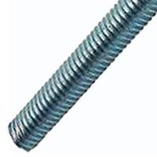

# Diğer Parçalar   &nbsp; &nbsp; 

| Parça Kodu        | Parça Açıklaması                   |Parça Boyutları | Parça Malzemesi | Kullanım Adedi |
|-------------------|-----------------------------------|-----------------|-----------------|----------------|
| [M201AA](#m201aa) | Direk                             |                 |  Paslanmaz      | 1              |
| [H302AA](#h302aa) | Alt Kapak Kalıp İçi Somun         | M6x14 mm        |  Pirinç         | 4              |
| [H123AA](#h123aa) | Base Toplama Saplaması            | Ø6 - 195 mm     |  Paslanmaz      | 4              |
| [H303AA](#h303aa) | Saplama Sonlandırma Somunu        | M6 Flanşlı      |  Paslanmaz      | 4              |
| [M102AA](#m102aa) | Direk Base Bağlantı Parçası       |                 |  Paslanmaz      | 1              |
| [H125AA](#h125aa) | Direk Base Bağlantı Saplaması     | Ø6 - 20 mm      |  Paslanmaz      | 2              |
| [H304AA](#h304aa) | Direk Base Bağlantı Somunu        | M6              |  Paslanmaz      | 2              |
| [H124AA](#h124aa) | Direk Base Bağlantı Civatası      | M5x12 mm        |  Paslanmaz      | 2              |
| [H305AA](#h305aa) | Direk Base Bağlantı Somunu        | M5              |  Paslanmaz      | 2              |
| [M402AA](#m402aa) | Rüzgar giriş parçası              |                 |  Pirinç         | 6              |
| [H306AA](#h306aa) | Rüzgar giriş kontra somunu        | M6 x 3.2mm      |  Paslanmaz      | 6              |
| [H902AA](#h902aa) | Rüzgar Sensör Hortumu             |     M6          | Pnomatik Hortumu| 6              |

---
# M201AA Direk &nbsp; &nbsp; 
| Parça Kodu | Parça Açıklaması             | Parça Boyutları | Parça Malzemesi | Kullanım Adedi |
|------------|------------------------------|-----------------|-----------------|----------------|
| M201AA     | Direk                        |  2 metre?       | 50x50x2mm Profil| 1              |

## Açıklama
[Meteoroloji Base Unitesi](../../P101DA-Rain/Readme.md) bu direğin üstüne [Direk Base Bağlantı Parçası](#m102aa-direk-base-bağlantı-parçası) ile bağlanır. 
Direğin alt ucu yere saplama şeklinde geçmesi planlanmaktadır. 

## Eksikler ve Yapılacaklar
Direğin üst kısmında [Direk Base Bağlantı Parçası](#m102aa-direk-base-bağlantı-parçası)nın bağlanacağı yerdeki deliklerin yeri ve çapı 

---

# H302AA Alt Kapak Kalıp İçi Somun &nbsp; &nbsp; 

| Parça Kodu | Parça Açıklaması             | Parça Boyutları | Parça Malzemesi | Kullanım Adedi |
|------------|------------------------------|-----------------|-----------------|----------------|
| H302AA     | Alt Kapak Kalıp İçi Somun    | Ø6x14 mm        |  Pirinç         | 4              |

## Açıklama

[H123AA Saplama](#h302aa-alt-kapak-kalıp-i̇çi-somun)nın bağlandığı somunlardır.  

---

# H123AA Base Toplama Saplaması &nbsp; &nbsp; 

| Parça Kodu | Parça Açıklaması             | Parça Boyutları | Parça Malzemesi | Kullanım Adedi |
|------------|------------------------------|-----------------|-----------------|----------------|
| H123AA     | Base Toplama Saplaması       | Ø6 - 195 mm     |  Paslanmaz      | 4              |

## Açıklama
Base ünitesinin [C115AA - Alt Kapak](../C115AA/README.md)'a  bağlanan ve üst kısım hariç diğer parçaları toplayan saplamadır. 

---

# H303AA Saplama Sonlandırma Somunu &nbsp; &nbsp; 

| Parça Kodu | Parça Açıklaması             | Parça Boyutları | Parça Malzemesi | Kullanım Adedi |
|------------|------------------------------|-----------------|-----------------|----------------|
| H303AA     | Saplama Sonlandırma Somunu   | Ø6 mm Flanşlı   |  Paslanmaz      | 4              |

## Açıklama
[H123AA Saplaması](../H123AA/Readme.md)nı sonlandıran somunlardır.  

---

# M102AA Direk Base Bağlantı Parçası &nbsp; &nbsp; 
| Parça Kodu | Parça Açıklaması             | Parça Boyutları | Parça Malzemesi | Kullanım Adedi |
|------------|------------------------------|-----------------|-----------------|----------------|
| M102AA     | Direk Base Bağlantı Parçası  |                 |  Paslanmaz      | 1              |

## Açıklama
[Direk](#m201aa-direk) ile [P101DA-Base](../../P101DA-Base/Readme.md) üniteyi birleştiren parçadır. 
Üzerine 2 adet [Saplama](#h125aa-direk-base-bağlantı-saplaması) kaynatılır. 
Bu 2 saplama Direk üzerindeki deliklere geçer ve 2 adet [somun](#h304aa-m6-somun) bağlanır.  
Bu parça Ana Üniteye [H124AA Civatası](#h124aa-direk-base-bağlantı-civatası) ve 2 adet [M5 Somun](#h305aa-direk-base-bağlantı-somunu) ile bağlanır.  

## Eksikler ve Yapılacaklar
Parçanın çizimi eksik. 

---
 

# H125AA Direk Base Bağlantı Saplaması  &nbsp; &nbsp; 

| Parça Kodu | Parça Açıklaması             | Parça Boyutları | Parça Malzemesi | Kullanım Adedi |
|------------|------------------------------|-----------------|-----------------|----------------|
| H125AA     | Direk Base Bağlantı Saplaması| Ø6 - 20 mm      |  Paslanmaz      | 2              |

## Açıklama
Bağlantı parçasının üzerine kaynatılan 2 adet saplamadır. 

---

# H304AA M6 Somun   &nbsp; &nbsp; 

| Parça Kodu | Parça Açıklaması             | Parça Boyutları | Parça Malzemesi | Kullanım Adedi |
|------------|------------------------------|-----------------|-----------------|----------------|
| H304AA     | Direk Base Bağlantı Somunu   | M6              |  Paslanmaz      | 2              |

## Açıklama
Bağlantı parçasının direğe bağlayan somunlardır. 

---

# H124AA Direk Base Bağlantı Civatası   &nbsp; &nbsp; 

| Parça Kodu | Parça Açıklaması             | Parça Boyutları | Parça Malzemesi | Kullanım Adedi |
|------------|------------------------------|-----------------|-----------------|----------------|
| H124AA     | Direk Base Bağlantı Civatası | M5x12 mm        |  Paslanmaz      | 2              |

Bağlantı parçasının Ana üniteye bağlayan civatalardır. 

---

# H305AA Direk Base Bağlantı Somunu   &nbsp; &nbsp; 

| Parça Kodu | Parça Açıklaması             | Parça Boyutları | Parça Malzemesi | Kullanım Adedi |
|------------|------------------------------|-----------------|-----------------|----------------|
| H305AA     | Direk Base Bağlantı Somunu   | M5              |  Paslanmaz      | 2              |

Bağlantı parçasının Ana üniteye bağlayan civataları bağlar. 

---
# M402AA Rüzgar Giriş Parçası &nbsp; &nbsp; 
| Parça Kodu       | Parça Açıklaması             | Parça Boyutları | Parça Malzemesi | Kullanım Adedi |
|------------------|------------------------------|-----------------|-----------------|----------------|
|  M402AA          | Rüzgar giriş parçası         |   14x10 mm      |  Pirinç         | 6              |
## Açıklama
Base ünitesi üzerinde bulunan rüzgar giriş hollerine takılır. 
Özel olarak ürettirilmektedir.  
m6 x 3.2 mm kontra somun ile bağlanmaktadır.  
İç tarafından hortum ile DP sensörlerine bağlanmaktadır.  

---

# H306AA Rüzgar giriş kontra somunu &nbsp; &nbsp; 
| Parça Kodu       | Parça Açıklaması             | Parça Boyutları | Parça Malzemesi | Kullanım Adedi |
|------------------|------------------------------|-----------------|-----------------|----------------|
|  H306AA          | Rüzgar giriş kontra somunu   | M6 x 3.2mm      |  Paslanmaz      | 6              |
## Açıklama
Rüzgar giriş parçasını base üniteye sabitleyen somundur.  

---
# H902AA Rüzgar Sensör Hortumu  &nbsp; &nbsp; 
| Parça Kodu       | Parça Açıklaması             | Parça Boyutları | Parça Malzemesi | Kullanım Adedi |
|------------------|------------------------------|-----------------|-----------------|----------------|
|  H902AA          | Rüzgar Sensör Hortumu        | M6              |Pnomatik Hortumu | 6              |
## Açıklama
Rüzgar giriş parçalarından alınan basıncı DP sensörlere ileten hortumdur. 

---