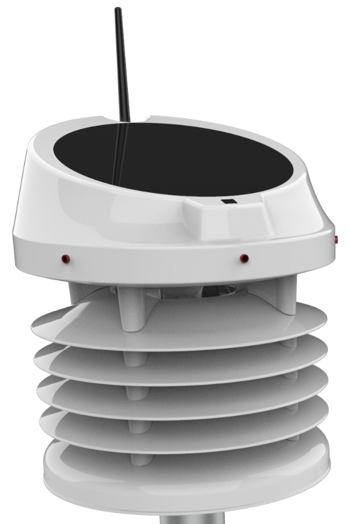

 # P101DA - Meteoroloji İstasyonu Base Ünite  &nbsp; &nbsp; 

| Parça Kodu                        | Parça Açıklaması             | Parça Boyutları | Parça Malzemesi | Kullanım Adedi |
|-----------------------------------|------------------------------|-----------------|-----------------|----------------|
| [C111DA](C111DA/)        | Üst Gövde                    | Ø245 x 100 mm   | ABS             | 1              |
| [C112BA](C112BA/)        | Radyasyon Kalkanı Yaprakları | Ø230 - 46.4 mm  | ABS             | 5              |
| [C113CA](C113CA/)        | Üst Gövde Alt Kapağı         | Ø244.4 - 140 mm | ABS             | 1              |
| [C114CA](C114CA/)        | Alt Gövde                    | Ø230 - 54,2 mm  | ABS             | 1              |
| [C115BA](C115BA/)        | Alt Kapak                    | Ø235 - 21 mm    | ABS             | 1              |
| [C116AA](C116AA/)        | UV Sensör Merceği            | 5x16x36mm       | ABS             | 1              |
| [PV Cell](PV%20Cell/)    | Solar Panel                  | Ø180 x 2 mm     | Monocrystal     | 1              |
| [Diğer Parçalar](Diğer/) |                              |                 |                 |                |

Bahsi geçen parçalar birleştirilerek P101DA-Base Ünitesi oluşturulmaktadır.  

