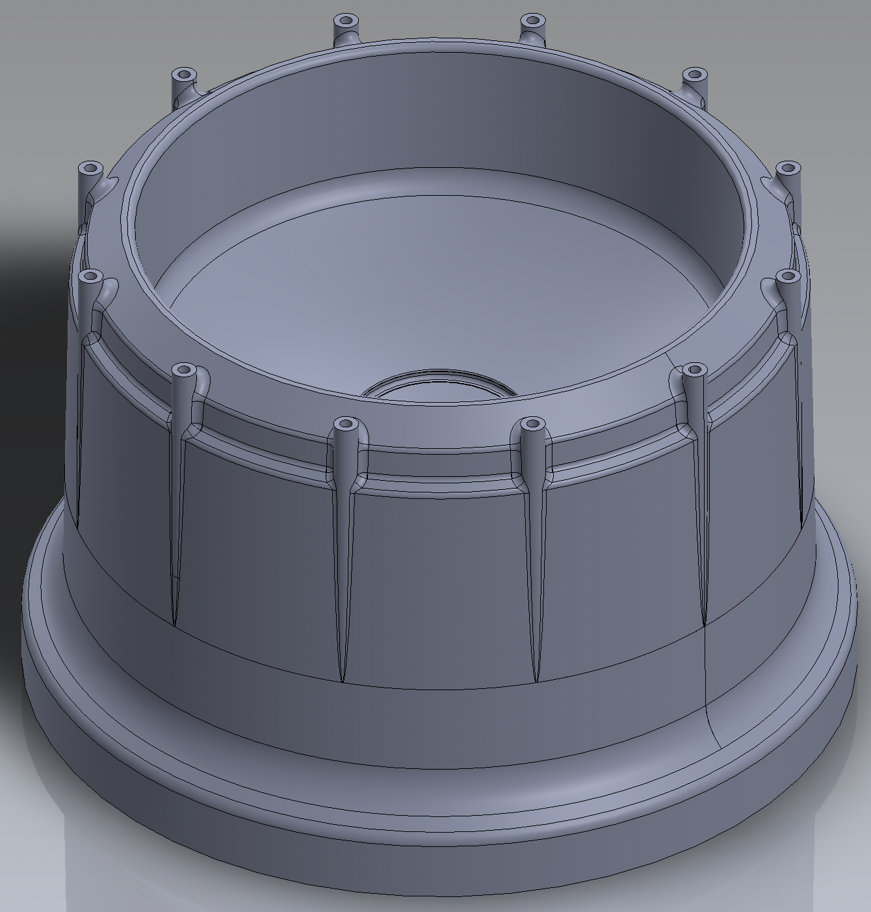
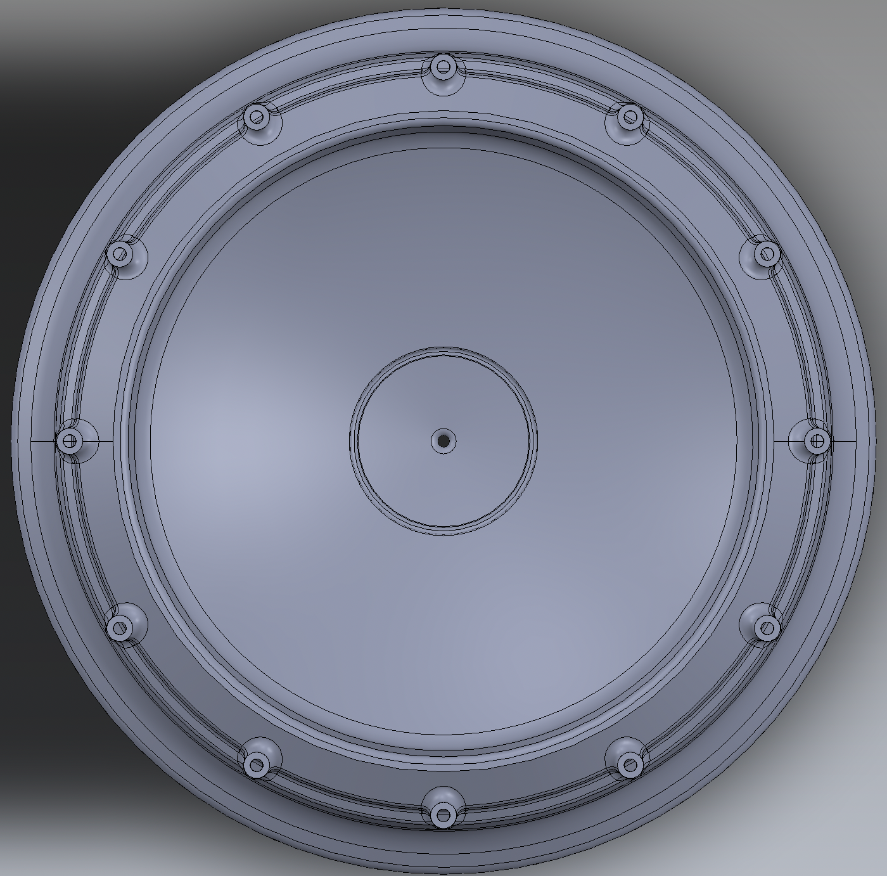
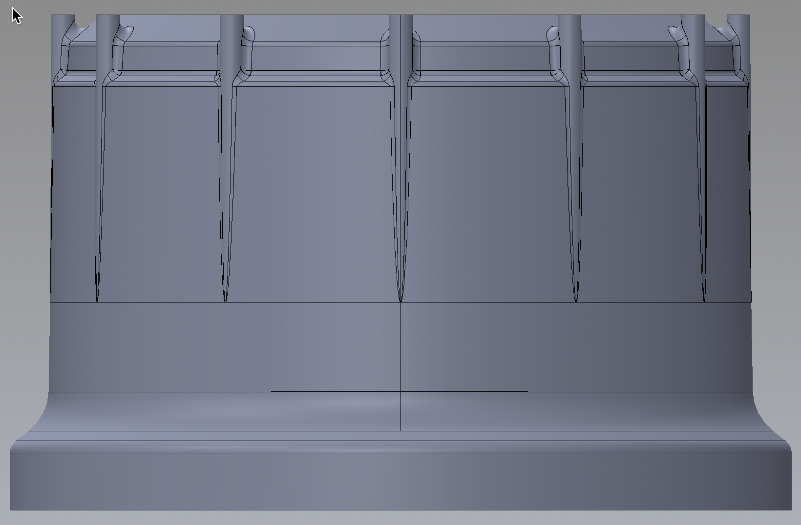
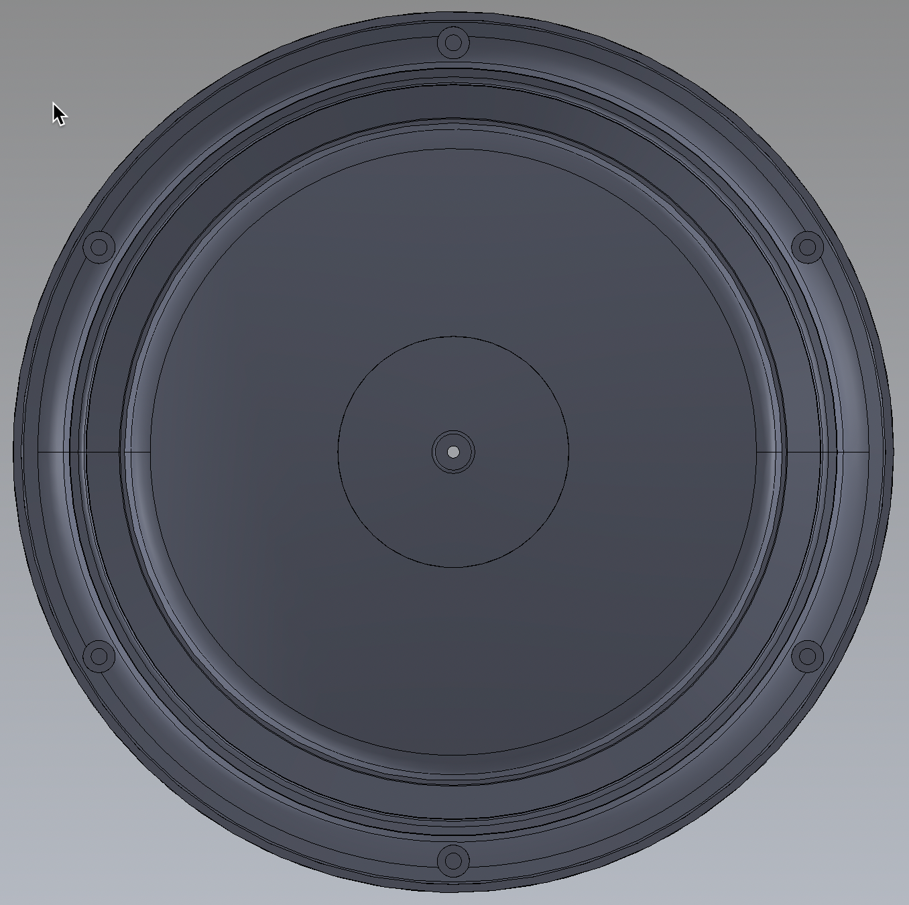

# C121AA YAĞMUR ÖLÇÜM HUNİ GÖVDE &nbsp; &nbsp; 

| Parça Kodu | Parça Açıklaması | Parça Boyutları | Parça Malzemesi | Kullanım Adedi |
| ---------- | ---------------- | --------------- | --------------- | -------------- |
| C121AA     | Huni gövdesi     | Ø218 x 138.4 mm | ABS             | 1              |

## Açıklama
Yağmur ölçüm ünitesinin huni gövdesi kısmıdır. Bu ürün 6 xxx vida ile [C122AA](../C122AA/Readme.md) parçasına bağlanır. 
Huninin boşaltım deliğinin üst kısmına sert geçme yöntemiyle [C125AA](../C125AA/Readme.md) Orta Kuşkonmaz parçası bağlanır. 
Üst kısmında 12 adet 3,2 ?mm kalınlığında [C126AA](../C123AA/Readme.md) Taç kuşkonmaz pimi takılacaktır. 

# Maliyet

## __

