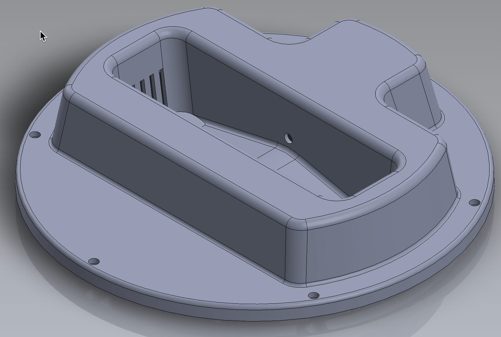
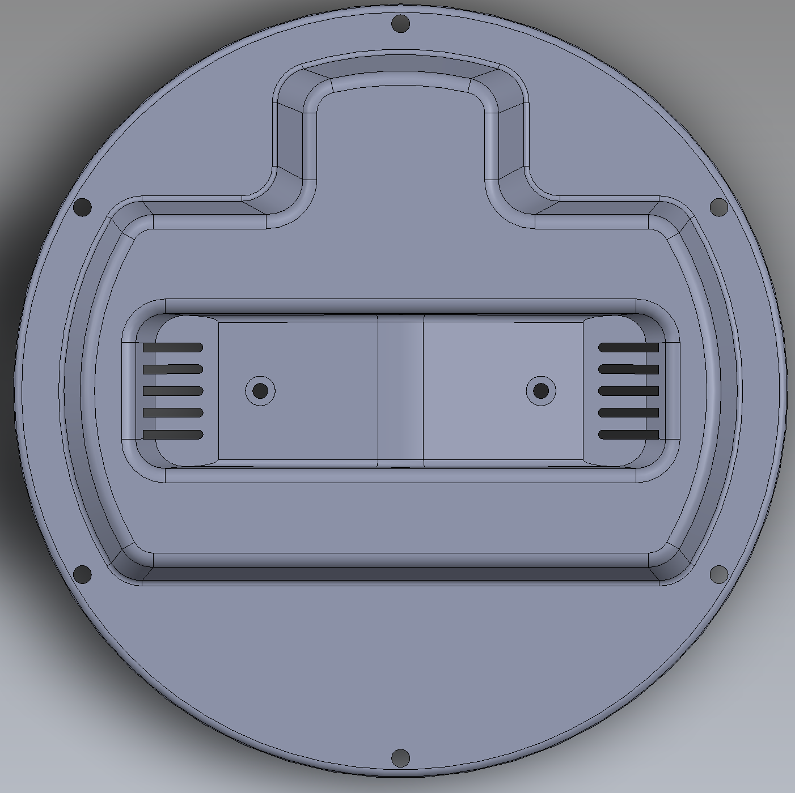
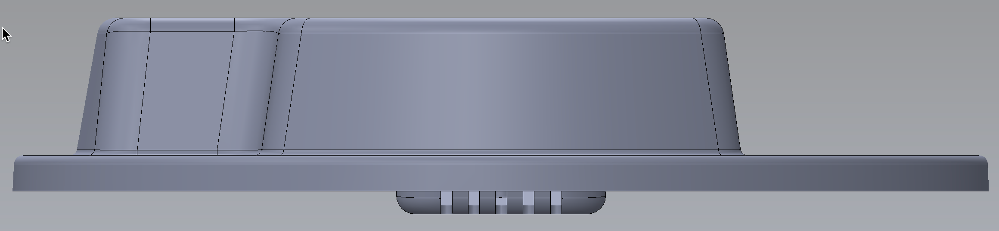
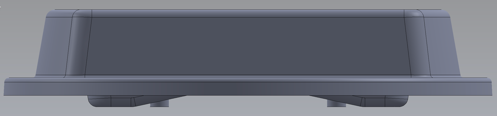

# C122AA YAĞMUR ÖLÇÜM ALT GÖVDE  &nbsp; &nbsp; 
| Parça Kodu | Parça Açıklaması | Parça Boyutları | Parça Malzemesi | Kullanım Adedi |
| ---------- | ---------------- | --------------- | --------------- | -------------- |
| C121AA     | Alt gövde        | Ø213.6 x 42.8   | ABS             | 1              |

## Açıklama
Yağmur ölçüm ünitesinin alt kısmıdır. Bu ürün 6 xxx vida ile [C121AA](../C121AA/Readme.md) parçasına bağlanır. 
[Kepçe](../C123AA/Readme.md) 5mm [Kepçe Pimi]() ve iki sekman ? ile bu üniteye bağlanır. 
[Zemin Düzenleyici Terazi]() bu ünite üzerine yapıştırılır. 
Elektronik kart bu ünitedeki kızağa sürülerek takılır ve bulunduğu bölüm epoksi ile doldurulur. 
Kepçe hacmi [Kepçe kalibrasyon Vidası](../H111AA/Readme.md) ile ayarlanır. 
[Metal Kaide M301AA](../M301AA/Readme.md) 4adet X vida ile bu üniteye bağlanır. 

# Maliyet

# Eksikler ve Yapılacaklar
    - Kalibrasyon vidası ve alt kaide bağlantıları için insert/kalıp somun kullanılıyor mu?
    - Kullanılan insert somunların ölçüleri?

# 2D Resimler

