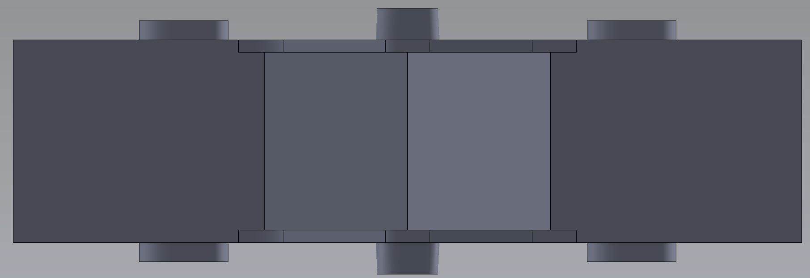

# C123AA YAĞMUR ÖLÇÜM KEPÇE  &nbsp; &nbsp; 
| Parça Kodu | Parça Açıklaması | Parça Boyutları | Parça Malzemesi | Kullanım Adedi |
| ---------- | ---------------- | --------------- | --------------- | -------------- |
| C123AA     | Kepçe            | 124x47.5x42 mm  | ABS             | 1              |

## Açıklama
Kepçe [Kepçe Bağlantı Pimi H601AA](../H601AA/Readme.md) ile [Alt Gövde](../C122AA/Readme.md)ye bağlanır. 
Üzerine 2 adet [Kepçe Mıknatısı H901AA](../H901AA/Readme.md) yapıştırılır. 

# Maliyet

# Eksikler ve Yapılacaklar
## __

