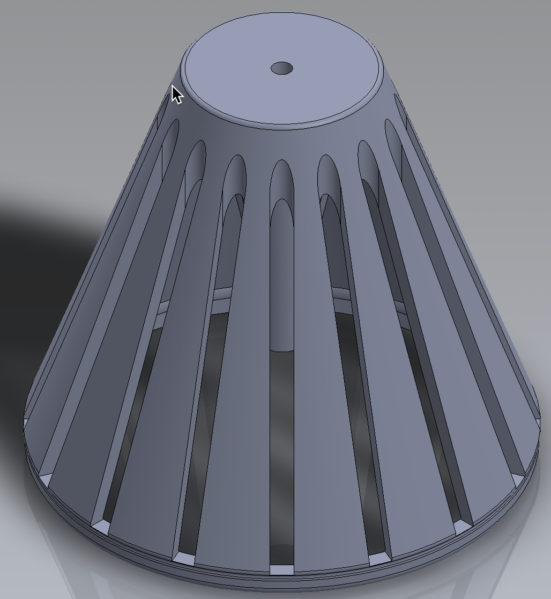
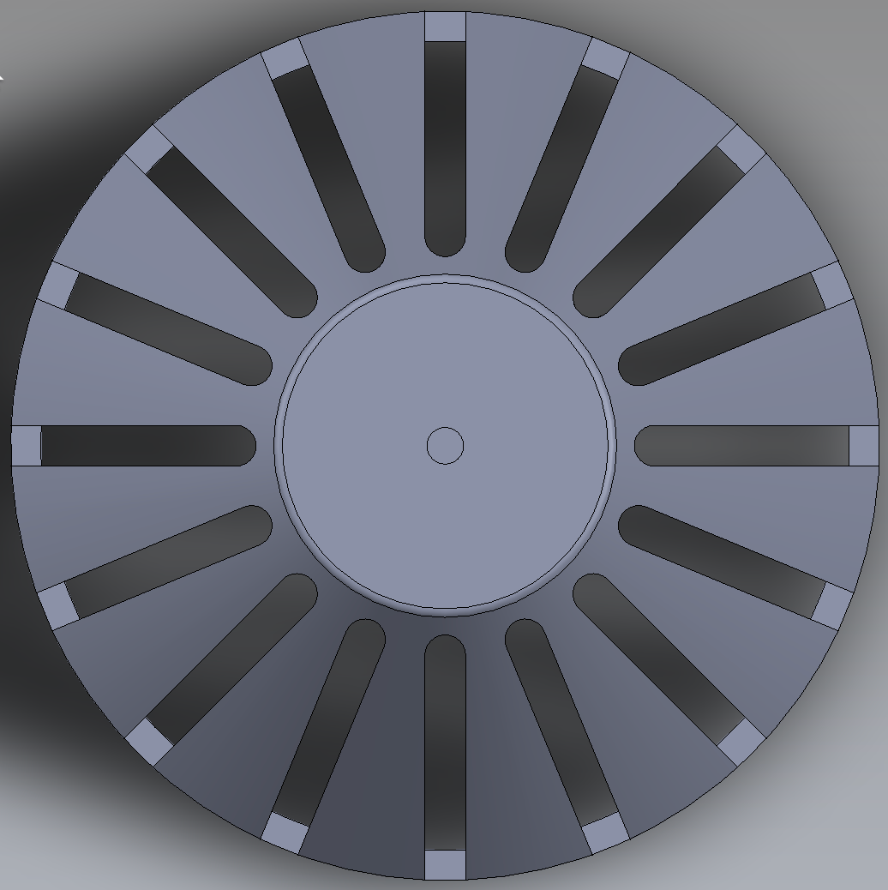
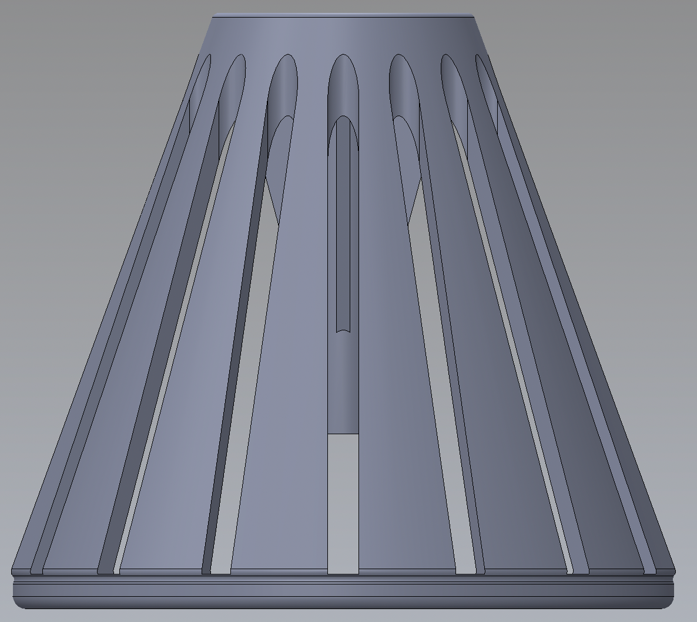
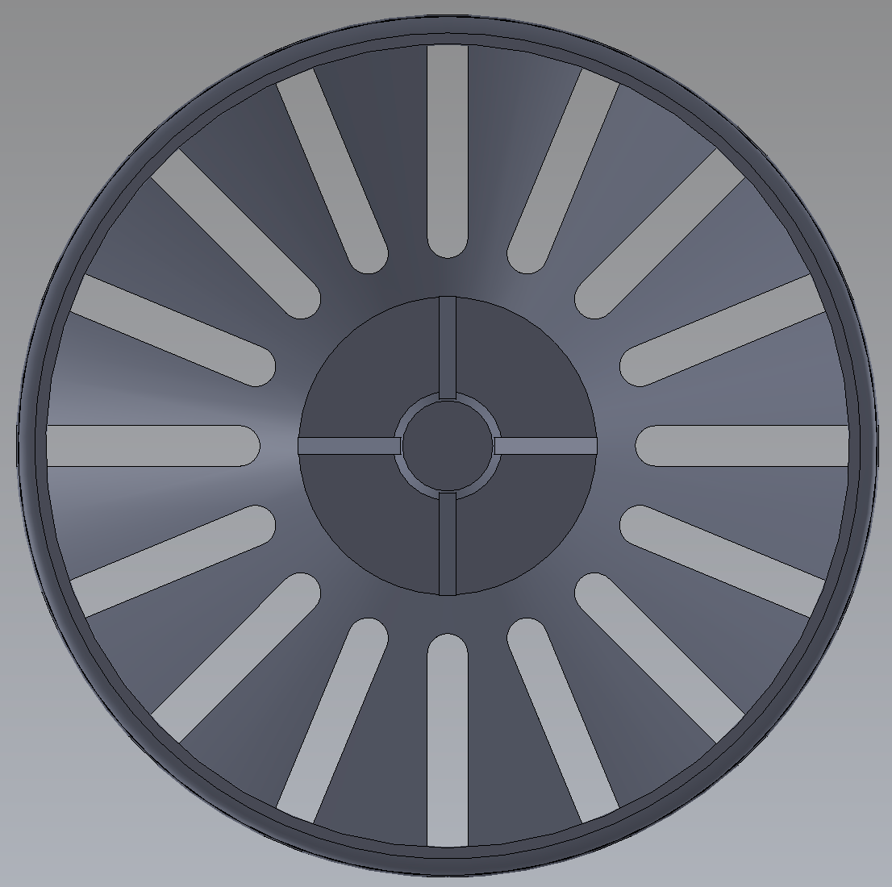

# C125AA	Orta Kuşkonmaz Yuvası  &nbsp; &nbsp; 

| Parça Kodu | Parça Açıklaması             | Parça Boyutları | Parça Malzemesi  | Kullanım Adedi |
|------------|------------------------------|-----------------|------------------|----------------|
| C125AA     | Orta Kuşkonmaz Yuvası        | Q47x42.5 mm     | ABS              | 1             |

## Açıklama
Kuşların cihaz üstüne konmasını engellemek için planlanmıştır.  
[Huni](../C121AA/Readme.md) üzerinde haznenin ortasına sert şekilde takılması planlanmıştır. 
Bu parçanın ortasına [C126AA Orta Kuşkonmaz Pimi](../C126AA/Readme.md) sert takılacak şekilde planlanmıştır.

## Eksikler ve Yapılacaklar

