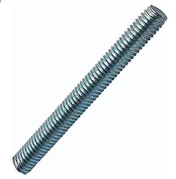
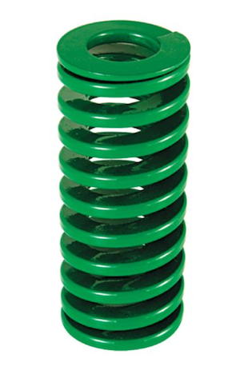
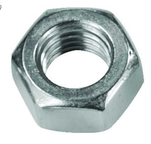
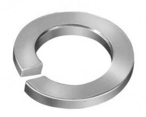
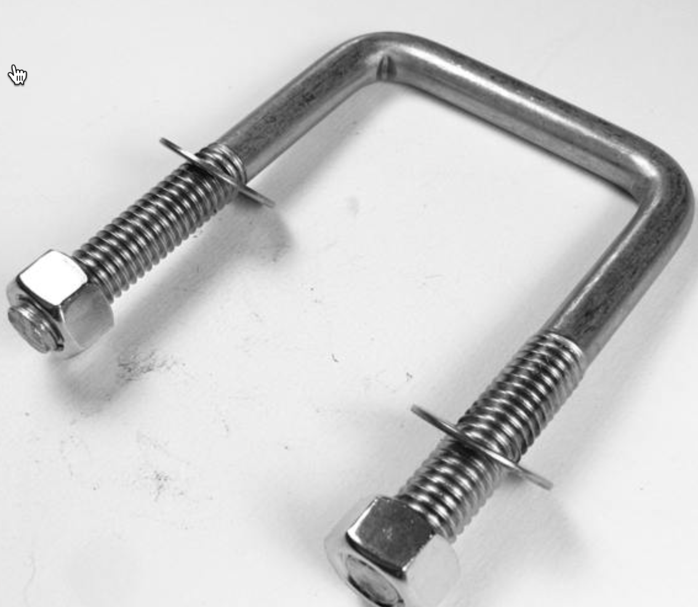
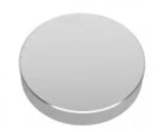
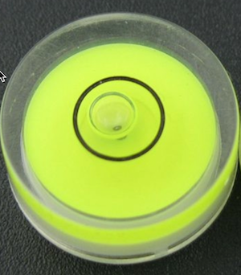
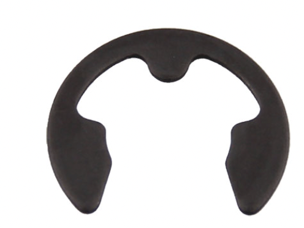
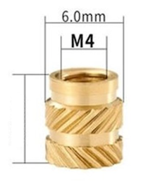

# Diğer Parçalar &nbsp; &nbsp; 

| Parça Kodu            | Parça Açıklaması                  | Parça Boyutları | Parça Malzemesi  | Kullanım Adedi |
|-----------------------|-----------------------------------|-----------------|------------------|----------------|
| [H111AA](#h111aa)     | Kepçe Kalibrasyon Vidası          |                 | Paslanmaz ?      | 2              |
| [H112AA](#h112aa)     | Metal Kaide Montaj Vidası         |                 | Paslanmaz ?      | 4              |
| [H113AA](#h113aa)     | Alt Gövde-Huni Bağlantı Vidası    |                 | Paslanmaz ?      | 6              |
| [H122AA](#h122aa)     | Seviye Ayar Saplaması             |                 | Paslanmaz ?      | 3              |
| [H210AA](#h210aa)     | Montaj Kolu U-Cıvata Seti         |                 | paslanmaz?       | 2              |
| [H301AA](#h301aa)     | Seviye Ayar Somunu                |                 | Paslanmaz ?      | 6              |
| [H401AA](#h401aa)     | Seviye Ayar Yaylı Rondela         |                 | Paslanmaz ?      | 3              |
| [H801AA](#h801aa)     | Seviye Ayar Yayı                  |                 | Paslanmaz ?      | 3              |
| [H901AA](#h901aa)     | Kepçe Mıknatısı                   |                 | Neodmiyum        | 2              |
| [H910AA](#h910aa)     | Su Terazisi                       |                 | ?                | 1              |
| [H602AA](#h602aa)     | Kepçe Pimi Sekmanı                | DIN 6799 4 mm   | Paslanmaz        | 2              |
| [H307AA](#h307aa)     | Insert somun                      |  M4             | Pirinç           | 12             |

## H111AA Kepçe Kalibrasyon Vidası &nbsp; &nbsp; 
| Parça Kodu | Parça Açıklaması             | Parça Boyutları | Parça Malzemesi  | Kullanım Adedi |
|------------|------------------------------|-----------------|------------------|----------------|
| H111AA     | Kepçe Kalibrasyon Vidası     |      M4x30mm    | Paslanmaz ?      | 2              |

### Açıklama
Kepçe haznesinin devrilme hacmini ayarlayan vidalardır. 
[C122A Alt Ünite](../C122AA/Readme.md) üzerinde açık inserte takılacak. 
Kalibrasyon sonunda civata sert bir yapıştırıcı ile sabitlenecek. 

### Eksik ve Yapılacaklar
Boyutları ve teknik resmi eksik.

---
## H112AA	Metal Kaide Montaj Vidası &nbsp; &nbsp; 

| Parça Kodu | Parça Açıklaması             | Parça Boyutları | Parça Malzemesi  | Kullanım Adedi |
|------------|------------------------------|-----------------|------------------|----------------|
| H112AA     | Metal Kaide Montaj Vidası    |       ?         | Paslanmaz ?      | 4              |

### Açıklama
[Metal Kaide M301AA](../M301AA/Readme.md)'yı [Alt Ünite C122AA](../C122AA/Readme.md)'ya bağlayan 4 vidadır.  

## Eksikler ve Yapılacaklar
Vida özellikleri ve boyutları eksik

---
## H113AA Alt Gövde-Huni Bağlantı Vidası &nbsp; &nbsp; 

| Parça Kodu | Parça Açıklaması                  | Parça Boyutları | Parça Malzemesi  | Kullanım Adedi |
|------------|-----------------------------------|-----------------|------------------|----------------|
| H113AA     | Alt Gövde-Huni Bağlantı Vidası    |                 | paslanmaz?       | 6              |

### Açıklama

[Alt Gövde](../C122AA/Readme.md) ile Huni'yi bağlayan vidalardır.  

### Eksikler ve Yapılacaklar
Vida Boyutları ve özellikleri belirlenecek

---
##  H122AA Seviye Ayar Saplaması &nbsp; &nbsp; 
| Parça Kodu | Parça Açıklaması             | Parça Boyutları | Parça Malzemesi  | Kullanım Adedi |
|-------------|-----------------------------|-----------------|------------------|----------------|
|  H122AA     | Seviye Ayar Saplaması       |      6x? mm     | Paslanmaz ?      | 3              |
### Açıklama
[M301AA Metal Kaide](../M301AA/Readme.md)'ye  3 adet saplama kaynatılacak. 

### Eksikler ve Yapılacaklar
Listedeki ürünlerin özellikleri ve boyutları belirlenecek.  

---
##  H801AA Seviye Ayar Yayı &nbsp; &nbsp; 
| Parça Kodu | Parça Açıklaması             | Parça Boyutları | Parça Malzemesi  | Kullanım Adedi |
|-------------|-----------------------------|-----------------|------------------|----------------|
|  H801AA     | Seviye Ayar Yayı            |      6 mm       | Paslanmaz ?      | 3              |
### Açıklama

[M301AA Metal Kaide](../M301AA/Readme.md) ile [M101AA Montaj Kolu](../M101AA/Readme.md) arasına yay konulacak. 

### Eksikler ve Yapılacaklar
Listedeki ürünlerin özellikleri ve boyutları belirlenecek.  

---

##  H301AA Seviye Ayar Somunu &nbsp; &nbsp; 
| Parça Kodu | Parça Açıklaması             | Parça Boyutları | Parça Malzemesi  | Kullanım Adedi |
|-------------|-----------------------------|-----------------|------------------|----------------|
|  H301AA     | Seviye Ayar Somunu          |      6 mm       | Paslanmaz ?      | 6              |
### Açıklama
[M301AA Metal Kaide](../M301AA/Readme.md)'de kaynaklı saplamalar [M101AA Montaj Kolu](../M101AA/Readme.md)'na somun ve yaylı rondela ile bağlanacak. 

### Eksikler ve Yapılacaklar
Listedeki ürünlerin özellikleri ve boyutları belirlenecek.  

---

##  H401AA Seviye Ayar Yaylı Rondela &nbsp; &nbsp; 
| Parça Kodu | Parça Açıklaması             | Parça Boyutları | Parça Malzemesi  | Kullanım Adedi |
|-------------|-----------------------------|-----------------|------------------|----------------|
|  H401AA     | Seviye Ayar Yaylı Rondela   |      6 mm       | Paslanmaz ?      | 3              |

---
## H210AA Montaj Kolu U-Cıvata Seti &nbsp; &nbsp; 

| Parça Kodu | Parça Açıklaması             | Parça Boyutları | Parça Malzemesi  | Kullanım Adedi |
|------------|------------------------------|-----------------|------------------|----------------|
| H210AA     | Montaj Kolu U-Cıvata Seti    |                 | paslanmaz?       | 2              |

### Açıklama
Montaj kolunun direğe bağlanmasını sağlayan aparatlardır.  

### Eksikler ve Yapılacaklar
Ürün özellikleri ve boyutları belirlenecek.  

---
## H901AA Kepçe Mıknatısı &nbsp; &nbsp; 

| Parça Kodu | Parça Açıklaması             | Parça Boyutları | Parça Malzemesi  | Kullanım Adedi |
|------------|------------------------------|-----------------|------------------|----------------|
| H901AA     | Kepçe Mıknatısı              |   Ø10x2mm       |  Neodmium      | 2              |

[Örnek](https://www.magnetmarket.com.tr/yuvarlak-neodyum-miknatislar/cap-10mm-x-kalinlik-2mm-neodymium-magnet)

### Açıklama
Yağmur ünitesi [kepçesi](../C123AA/Readme.md) üzerinde 2 adet olarak kepçe üzerindeki ceplere sert bir şekilde takılacak. 

---

## H910AA Baloncuklu Yuvarlak Su Terazisi &nbsp; &nbsp; 

| Parça Kodu | Parça Açıklaması             | Parça Boyutları | Parça Malzemesi  | Kullanım Adedi |
|------------|------------------------------|-----------------|------------------|----------------|
| H910AA     | Su Terazisi                  |   15x6mm        | Plastik          | 1              |

[Örnek](https://www.aliexpress.com/item/32568605814.html?spm=a2g0o.cart.0.0.1a7b38daohxqyG&mp=1)

### Açıklama
Yağmur ünitesi montajı sırasında seviye gözlemi için kullanılmaktadır.
[Alt Ünite](../C122AA/Readme.md)'ye yapıştırılır.

---
## H602AA Kepçe Pimi Sekmanı  &nbsp; &nbsp; 
| Parça Kodu | Parça Açıklaması             | Parça Boyutları        | Parça Malzemesi  | Kullanım Adedi |
|------------|------------------------------|------------------------|------------------|----------------|
| H602AA     | Kepçe Pimi Sekmanı           | DIN 6799 Ay Segman 4 mm| Paslanmaz        | 2              |

### Açıklama
Kepçe piminin iki ucuna takılır. 

---
## H307AA Insert somun &nbsp; &nbsp; 
| Parça Kodu | Parça Açıklaması             | Parça Boyutları | Parça Malzemesi  | Kullanım Adedi |
|------------|------------------------------|-----------------|------------------|----------------|
| [H307AA]   | Insert somun                 |  M4             | Pirinç           | 12             |

### Açıklama
Huni, alt taban ve kalibrasyon vidalarının bağlandığı noktalarıda plastiğin içinde gömülü olan somunlardır. 
