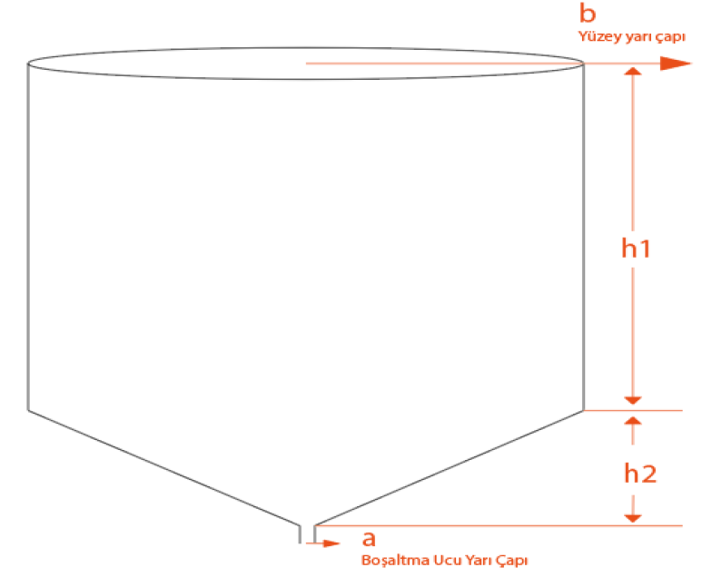
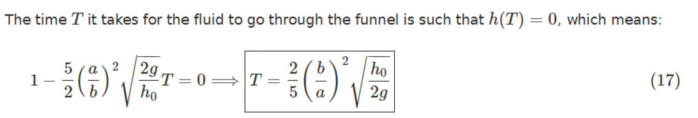

# Yağmur Modülü Hesaplamaları

**Yağış miktarı:** Yağmur miktarı, toprak yüzeyine düşen suyun, buharlaşmaya ve toprağa 
sızmaya uğramadan, meydana getireceği yükseklik ile tayin olunur. Yağmurun yüksekliği 
milimetre ile ifade edilir, Suyun özgül ağırlığı 1 gr/cm3 olduğuna 
göre 1 m2 alanda 1 mm yüksekliğindeki suyun ağırlığı 1 kg eder. 1 m2 
yüzey üzerinde 1 mm yüksekliğindeki yağış, 1 cm2 ye düşen 1 kg yağışa eşittir. 

Yani; 1 mm yağış = 1 kg/m2 = 1 litredir.

# Su Haznesi Hacmi

| Süre(dk)  | Miktar(mm)   | Yer  |  Tarih |
|:--:|---:|:-------------------|------------:|
| 5dk| 50.5|                HOPA|    7.07.1988|
|10dk| 60.6|                HOPA|    7.07.1988|
|15dk| 70.7|                HOPA|    7.07.1988|
|30dk| 90.9|                HOPA|    7.07.1988|
| 1SA|133.8|BARTIN,ULUS,CEYÜPLER|   10.08.2021|
| 2SA|210.0|BARTIN,ULUS,CEYÜPLER|10-11.08.2021|
| 3SA|252.8|BARTIN,ULUS,CEYÜPLER|10-11.08.2021|
| 4SA|332.3|             ANTALYA|    4.11.1995|
| 5SA|374.3|             ANTALYA|    4.11.1995|
| 6SA|390.3|             ANTALYA|    4.11.1995|
| 8SA|410.4|             ANTALYA|    4.11.1995|
|12SA|428.1|             ANTALYA|    4.11.1995|
|18SA|464.8|            MARMARİS|10-11.12.1992|
|24SA|490.8|       ANTALYA-KEMER|16-17.12.2018|

Meteoroloji GM Resmî sitesinde verilen maksimum yağış miktarları incelendiğinde haznemizin 
hacmi 1. Satırdaki 5dk-50,5 mm yağış değerlerini karşılamalıdır. 

Yağış alan yüzey alanımız 16cm çap için $(\pi r^2)$ 0,02 m2 dir. 
1m2 50,5 mm yağış alırsa, 0,02 m2 1,01 mm yağış alır.

1 m 2   &nbsp;&nbsp;&nbsp;&nbsp;&nbsp;&nbsp;50.5 mm

0.02 m 2   &nbsp;&nbsp;&nbsp;&nbsp;x = 1,01 mm

Bu hesaplamaya göre haznemizin minimum **hacmi** 1,01 lt veya 1010 cm3 olmalıdır.

# Su Boşalma Süresi

Ölçümlerimizin saatlik periyotlarla yapılacağı düşünüldüğünde belirlenen haznemizin içinde
 bulunan suyun maksimum 1 saat içinde boşalması gerekmektedir. Bunun için kabımızın şekli 
 konik olarak düşünüldüğünde koniğin suyu boşaltma ucunun çapı çok iyi belirlenmelidir. 
 Bunun için 
 [diego.assencio.com](https://diego.assencio.com/?index=62f54ab6114d473b6933ad5bf5a5fc88) 
 sitesindeki hesaplamalardan yararlanılmıştır. Şeklimiz 
 ve oranlar aşağıdaki verilen şekle yakındır.

  

a = 1,5 = 0,15 cm  mm &nbsp;&nbsp; b = 8cm &nbsp;&nbsp; h1 = 41mm = 4.1cm &nbsp;&nbsp; 
h2 = 27mm = 2.7cm &nbsp;&nbsp; $\pi$ = 3,14

**Silindir Hacmi:** $\pi r^2h$ = 823,936 ∼ 824 cm3
 
**Koni Hacmi:** $\pi(R^2+r^2+Rr)/3$ = 184,326 ∼ 184 cm3

**Toplam Hacim:** $824+184$ = 1008 cm3 

1008 cm3  = 1.008 Litre ∼ 1.01 Litre

 
  

 (g = 98 cm/s2 )

Bu formül huninin üst çap, alt çap ve yüksekliğinin bilindiği değerler için huninin 
tam boşaltma zamanının hesaplanması için kullanılmaktadır. Kullandığımız şekil 
bu formüle uygulandığı takdirde hesabın gerçek değerlere yakın olacağı düşünülmektedir. 
Formüle yukarda bilinen değerler ve boşaltma çapı için 3mm girildiğinde;

= 211 saniye = **3 dakika 31 saniye**

[**Yapılan Testte Sonuç:** 3  dakika 7 saniye]

(Hesaplanan ile ölçülen arasında 24 saniyelik bir fark var.)

# Kepçe Hacmi

Yukarıda MGM’nün tablosunda verilen 1 saatlik maksimum değer 133 mm olduğuna göre,

kepçe hacmimizi en az 4 ml, en fazla 10 ml olabilir.
Kepçe sayacımızı **1023 puls/saat** olarak alırsak;

Sensörümüz en az 4×1023 = 4,092 litre/saat,
(en fazla 10×1023 = 10,230 litre/saat) ölçüm yapabilir.

Kullanmayı planladığımız 6 ml, $6×1023=6,138$ litre/saat

Çapımız 16cm olarak belirlendiğinde m2’ye oran katsayısı $(1/0,02)$'den $50$’dir.

Sensörümüzün saatte en az ölçtüğü 6,138 litre yağmur değeri m2'de $6,138×50=306,9$ litredir.

Sonuç olarak **seçtiğimiz değerler maksimum yağış miktarını ölçmeye yeterlidir.**

# Hassasiyet

Hassasiyet = Kepçe Hacmi × 1m2'ye oranı

6 ml × 50 =300 ml     (1Lt➔1000mLt➔1mm olduğundan)

**Hassasiyet** = 0,3 mm ‘dir.

# Karşılaştırma Tablosu

|Teknik Özellikleri|[Lambrecht LMP02](https://metos.at/portfolio/lambrecht-rain-gauge/)|[Pessl IM523](https://www.agriexpo.online/prod/pessl-instruments-gmbh/product-169962-14626.html)|[WS-601(Aliexpress)](https://turkish.alibaba.com/product-detail/rainfall-collected-tipping-bucket-rain-gauge-rain-sensor-60654605407.html)|WeatherStat(10 ml)|WeatherStat (10 ml)|birim|
|--------------------------------|:---:|:---:|:---:|:---:|:---:|:---:|
|Huni Toplama Yüzey çapı         | 16  |  16 | 20  | 16  | 16  | cm      |
|Kepçe hacmi                     |  4  |  4  | 16  | 10  | 6  | cm3|
|Kepçenin dk maksimum devrilmesi |  80 | 60  | 60  | 35  | 68  | boşaltma|
|Darbe sayıcı max değer          |4800 |3600 |3600 |2100 |3600 | pulse/h |
|Ölçüm aralığı 0-max             |  16 |  12 | 30  |17,5 |20,3 | mm/min  |
|Çözünürlük                      | 0,2 | 0,2 | 0,5 | 0,5 | 0,3 | mm      |
|Doğruluk                        |  4  |  4  | 10  | 10  |  6  | ±%      |
|Huni toplama                    | 201 | 201 | 314 | 201 | 201 | cm2|
|Boyutlar / Ağırlık              | -   | -   |  -  | -   | -   |         |

