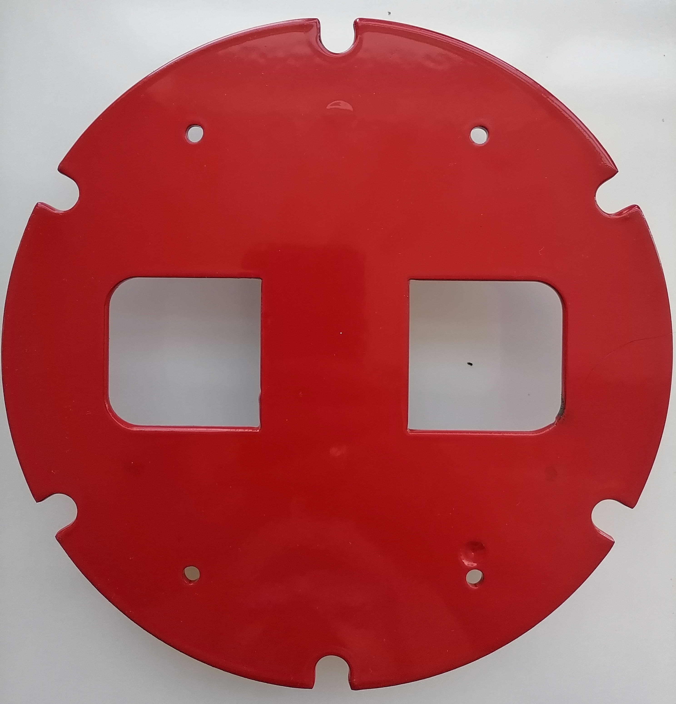
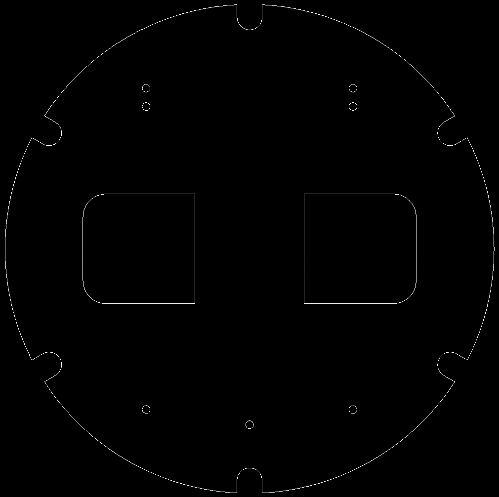

# M301AA	Metal Kaide  &nbsp; &nbsp; 

| Parça Kodu | Parça Açıklaması             | Parça Boyutları | Parça Malzemesi  | Kullanım Adedi |
|------------|------------------------------|-----------------|------------------|----------------|
| M301AA     | Metal Kaide                  |   Q214x3 mm     | paslanmaz?       | 1              |

## Açıklama
Yağmur Ünitesi [Alt Gövde](../C122AA/Readme.md)'sine 4xx vida ile bağlanır.

## Eksikler ve Yapılacaklar
sldprt dosyası yok. 
Konnektör bağlantı yeri yok. 

## 2D

### DXF Görüntüsü
