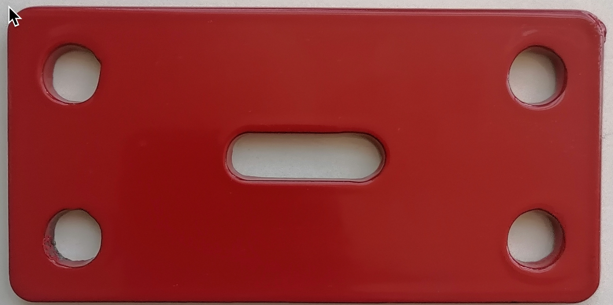

# M302AA Montaj Kolu-Direk Bağlantı Aparatı  &nbsp; &nbsp; 

| Parça Kodu | Parça Açıklaması                   | Parça Boyutları | Parça Malzemesi  | Kullanım Adedi |
|------------|------------------------------------|-----------------|------------------|----------------|
| C121AA     | Montaj Kolu-Direk Bağlantı Aparatı |   108x54x3 mm   | paslanmaz?       | 1              |

## Açıklama
Montaj Kolunun direğe bağlanması için gereken aparattır.  

## Eksikler ve Yapılacaklar
Sldprt dosyası eksik. 

## 2D

