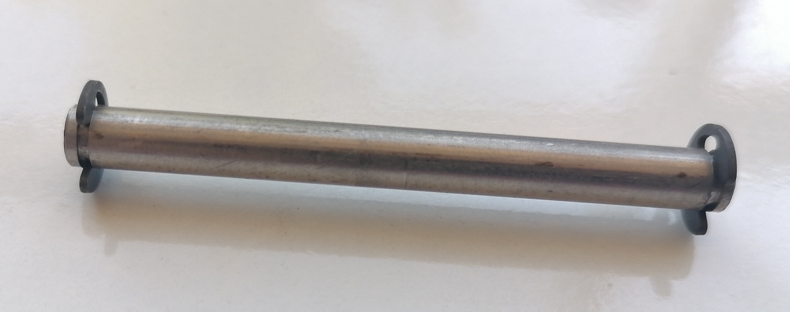

# H701AA Kepçe Pimi ve Sekmanı  &nbsp; &nbsp; 
| Parça Kodu | Parça Açıklaması             | Parça Boyutları | Parça Malzemesi  | Kullanım Adedi |
|------------|------------------------------|------------------------|----------------|----------------|
| H701AA     | Kepçe Pimi                   |         ?              | Paslanmaz  ?   | 1              |
| H602AA     | Kepçe Pimi Sekmanı           | DIN 6799 Ay Segman 4 mm| Paslanmaz      | 2              |

## Açıklama
[Kepçe](../C123AA/Readme.md) , [Alt Gövde](../C122AA/Readme.md)'ye bu Kepçe pimi ile bağlanır. 
Pim uçları 4mm DIN 6799 Ay Segman ile sonlandırılır.  
# __
### Kepçe Pimi

