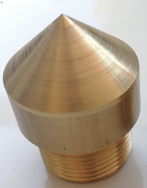
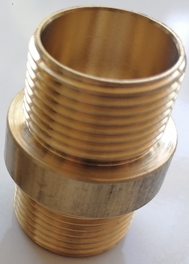

# P101DA - Meteoroloji İstasyonu Soil Ünite &nbsp; &nbsp; 

| Parça Kodu | Parça Açıklaması             | Parça Boyutları | Parça Malzemesi  | Kullanım Adedi |
|------------|------------------------------|-----------------|------------------|----------------|
| [M403AA](#m403aa)     |Sıcaklık Sensörü Alt Metal Parça   |                 |  Pirinç          | 1              |
| [M404AA](#m404aa)     |Sıcaklık Sensörü Orta Metal Parça  |                 |  Pirinç          | 3              |
| [H903AA](#h903aa)     |PVC Boru                      |                 |  PVC             | 4              |
| [H904AA](#h904aa)     |Üst Kapak                     |                 |  PVC             | 1              |

Bahsi geçen parçalar birleştirilerek P101DA-Soil cihazı plastik aksamı oluşturmaktadır. 

## Eksikler ve Yapılacaklar
- 
 

---
# M403AA Sıcaklık Sensörü Alt Metal Parça &nbsp; &nbsp; 
| Parça Kodu | Parça Açıklaması                  | Parça Boyutları | Parça Malzemesi  | Kullanım Adedi |
|------------|-----------------------------------|-----------------|------------------|----------------|
| M403AA     |Sıcaklık Sensörü Alt Metal Parça   | Ø32x38.5 mm     |  Pirinç          | 1              |

## Açıklama
Toprak altı ısı sensörünün 90cm derinlikteki ısıyı sensöre aktaracak parçadır. 
Özel olarak ürettirilmektedir. 
İç kısmında NTC sensör yerleştirilen Ø2x8 mm delik vardır. 

## Eksikler ve Yapılacaklar
    - 
 

---

# M404AA Sıcaklık Sensörü Orta Metal Parça &nbsp; &nbsp; 
| Parça Kodu | Parça Açıklaması                   | Parça Boyutları | Parça Malzemesi  | Kullanım Adedi |
|------------|------------------------------------|-----------------|------------------|----------------|
| M404AA     |Sıcaklık Sensörü Orta Metal Parça   | Ø32x30 mm     |  Pirinç          | 3             |

## Açıklama
Toprak altı ısı sensörünün 10/30/60cm derinlikteki ısıyı sensöre aktaracak parçalardır. 
Özel olarak ürettirilmektedir. 
İç kısmında NTC sensör yerleştirilen Ø2x8 mm delik vardır. 

## Eksikler ve Yapılacaklar
    - 
 

---

# H903AA PVC Boru &nbsp; &nbsp; 
| Parça Kodu | Parça Açıklaması             | Parça Boyutları | Parça Malzemesi  | Kullanım Adedi |
|------------|------------------------------|-----------------|------------------|----------------|
| H903AA     |PVC Boru                      | Ø32x5mm-29 cm   |  PVC             | 2              |
|            |PVC Boru                      | Ø32x5mm-19 cm   |  PVC             | 1              |
|            |PVC Boru                      | Ø32x5mm-14 cm   |  PVC             | 1              |

## Açıklama
Metal parçaları birleştirmek için kullanılan PVC borulardır.(Dış Çap: 32mm, Et Kalınlığı:5mm) 
29/19 cm olan parçalar içten yivlidir(3/4"). Erkek yivli metal parçalar bu yivlere bağlanır. 
14 cm olan parçanın bir tarafı dişi yivli (3/4") diğer tarafı erkek yivlidir(1"). 
Erkek yivli tarafına üst kapak takılır. 

## Eksikler ve Yapılacaklar

---

# H904AA Üst Kapak &nbsp; &nbsp; 
| Parça Kodu | Parça Açıklaması             | Parça Boyutları | Parça Malzemesi  | Kullanım Adedi |
|------------|------------------------------|-----------------|------------------|----------------|
|H904AA      |Üst Kapak                     |                 |  PVC             | 1              |

## Açıklama
1" dişi yivli kör tapadır. 
14 cm PVCnin erkek yivli kısmına takılır. 
Üzerine G12-4p Mike socket takılacaktır. 

## Eksikler ve Yapılacaklar

## __

---